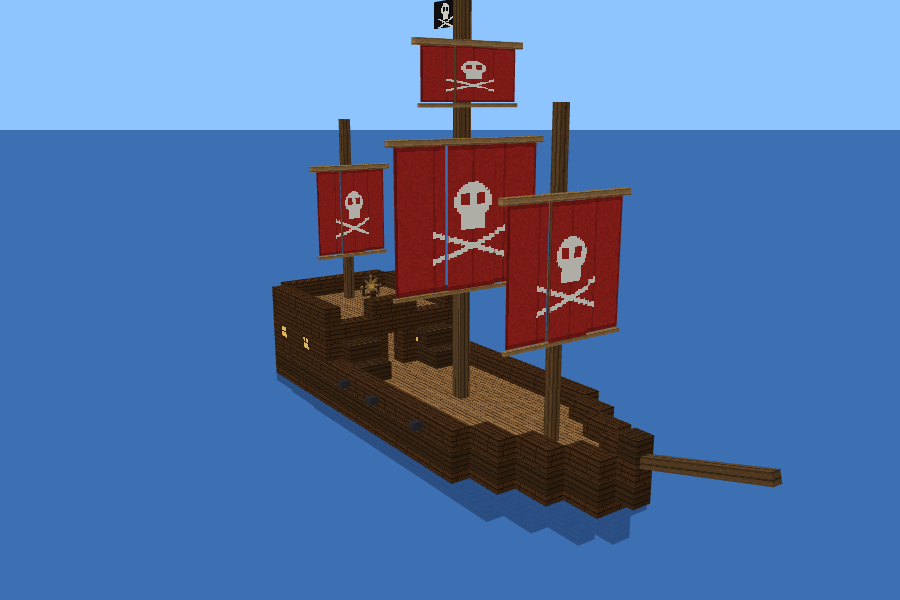

# Pirate Ship: a Minecraft Bedrock add-on



A big, sailable pirate ship for you and your friends. It's about the size of a
shipwreck (27 blocks long, 9 wide, 3 masts). It has a captain's cabin with a
large chest, a quarterdeck with a ship's wheel, cannons, lanterns and a jolly
roger. Anyone standing on deck sails along with it.

## Install

1. Download **`PirateShip.mcaddon`** from this folder's `dist/` directory (or
   from `/minecraft/PirateShip.mcaddon` on the website once it's deployed).
2. Open the file on the device running Minecraft (double-click it on Windows,
   or tap it and choose "Open in Minecraft" on a phone or tablet). Minecraft
   imports both packs.
3. Create or edit a world. Under **Behavior Packs**, activate
   **Pirate Ship (Behavior)**. The resource pack is added automatically.
4. The world's owner hosts the world, and friends join it as usual. Friends
   download the packs automatically when they join.

Requires Minecraft Bedrock **1.21.90 or newer**. No experimental toggles are
needed.

## Craft it

At a crafting table, using wool that is all the same colour, plus any kind of
planks:

```
 . W .        W = wool
 W W W        P = planks (any wood)
 P P P
```

## Sail it

| Action | How |
| --- | --- |
| Launch | Use the Pirate Ship item on water. The bow points the way you're facing. |
| Take the helm | Use (right-click or tap) the **ship's wheel** at the back, on the upper deck. |
| Sail forward / slow down / reverse | **W / S** (on touch or controller, the move stick) |
| Steer | **A / D** |
| Leave the helm | **Sneak** |
| Board from the water | Swim into the side of the ship and you climb onto the deck. |
| Get off | Jump over the railing. |
| Captain's chest | Go through the door under the upper deck and open the chest (54 slots). |
| Dye the sails | Hold any dye and use it on the **ship's wheel**. It works like dyeing a bed, and uses up one dye. |
| Pick the ship back up | Hit the ship's wheel about 10 times (not while at the helm). The ship drops as an item, and anything in the chest spills onto the deck. |

The ship stops when it runs into land. It sails at up to about 6 blocks per
second.

## How it works (for the curious)

- The ship is one big entity model. The wheel and the chest are two small
  entities that the script keeps in place on the ship.
- Players can't stand on entities in Bedrock, so while you're aboard the
  script builds an invisible **barrier-block** deck, railings, walls and stairs
  around your feet. As the ship moves, it moves you with it. Barriers only ever
  replace air or still water, and the original block is put back as soon as
  nobody needs the barrier. Barriers left over when a world is closed are also
  cleaned up the next time it loads.
- `build.py` generates the model, the textures (all hand-drawn in code), the
  deck layout and the recipes from one ship design. It then zips everything into
  `dist/PirateShip.mcaddon`. To change the ship, run
  `pip install pillow && python3 build.py`.

## Things to know

- This add-on was built against the official Bedrock scripting API
  (`@minecraft/server` 2.0.0) and the add-on file formats. The sailing, deck
  and barrier logic was tested against a simulated world, but not inside the
  game itself. If something misbehaves, the most likely spots are:
  - **Steering direction.** If A and D turn the wrong way, flip the sign on the
    `dYaw = -turn * ...` line in `PirateShip_BP/scripts/main.js`.
  - **Chest size.** If the chest shows 27 slots instead of 54, the game is
    limiting that container type.
- Walking around on a moving ship can feel a little jittery, because the game
  gets a new position for you every tick.
- The sail colour resets to white when you pick the ship up and put it down
  again.
- Barriers show up if you hold a barrier block in Creative mode. That's
  expected.
